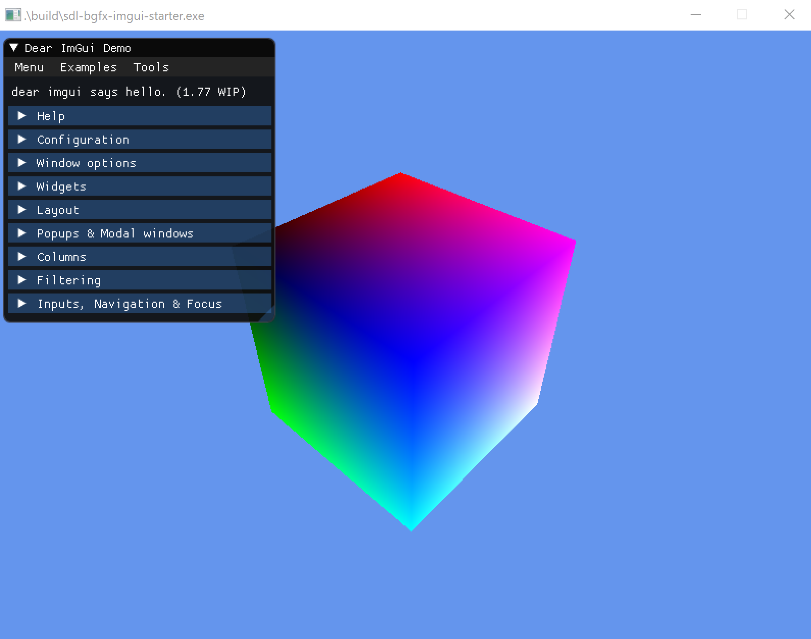

# sdl-bgfx-imgui-starter



The idea behind this repo is for it to be used as a minimal starting point for development of a game, demo or prototype.

It utilizes [SDL2](https://www.libsdl.org/index.php) for the windowing system, [bgfx](https://github.com/bkaradzic/bgfx) (by [@bkaradzic](https://twitter.com/bkaradzic)) for the graphics library and [Dear ImGui](https://github.com/ocornut/imgui) (by [@ocornut](https://twitter.com/ocornut)) for the user interface.

The code in `main.cpp` is derived from two excellent `bgfx` tutorials ([hello-bgfx](https://dev.to/pperon/hello-bgfx-4dka) by [Phil Peron](https://twitter.com/pperon) and [bgfx-ubuntu](https://www.sandeepnambiar.com/getting-started-with-bgfx/) by [Sandeep Nambiar](https://twitter.com/_sandeepnambiar)). I highly recommend checking them out.

This repo does not directly include any of these dependencies. Instead, CMake is used to download and install them so this project can use them. This is handled through the use of a _superbuild_.

## Prerequisites

To begin with create a directory to hold the repo:

```bat
mkdir sdl-bgfx-imgui-starter
cd sdl-bgfx-imgui-starter
```

Then clone the repo:

```bash
git clone https://github.com/pr0g/sdl-bgfx-imgui-starter.git .
```

This project comes with a _superbuild_ CMake script which will build all third party dependencies and the main application in one step. The third party dependencies are built and installed to a separate build folder in the third party directory. To achieve this CMake must be installed on your system (the repo has most recently been tested with CMake version `3.24`).

> __Note__: It is possible to build the third party dependencies separately, but the configure scripts described below now default to use `-DSUPERBUILD=ON` (as this is the simplest and most common workflow). If you do wish to build the third party dependencies separately, please see the third party [__README__](third-party/README.md) for full instructions on how to do this.
>
> __Note__: When building the dependencies, the libraries are by default self contained in the repo and are not installed to the system.

## Build Instructions

### All

Shaders for `bgfx` must be compiled to be loaded by the application (the starter has an incredibly simple shader supporting vertex colours). See `compile-shaders-<platform>.sh/bat` for details. `shaderc` is built as part of `bgfx` when first building the repo and is used to compile the shaders.

> __Note__: A number of `configure-<generator>.bat/sh` files are provided to run the CMake configure commands. `Ninja` is preferred as it's consistent across _macOS_, _Linux_ and _Windows_ (and it's very fast), any generator should work though. For example there's a `configure-vs-19/22.bat` for generating a Visual Studio 2019 or 2022 solution.

### Windows

- Run `configure-vs-19.bat`, `configure-vs-22.bat` or `configure-ninja.bat` located in the root directory to generate the build files required for the project.
- Run `cmake --build build\debug-ninja` and/or `cmake --build build\release-ninja` to compile the project using Ninja or `cmake --build build\vs<year> --config Debug` and/or `cmake --build build\vs<year> --config Release` if using the Visual Studio generator.
- Run `compile-shaders-win.bat` located in the root directory to build the shaders.
- Launch the application by running `build\debug-ninja\sdl-bgfx-imgui-starter.exe` or `build\release-ninja\sdl-bgfx-imgui-starter.exe` if using Ninja or `build\vs<year>\Debug\sdl-bgfx-imgui-starter.exe` or `build\vs<year>\Release\sdl-bgfx-imgui-starter.exe` if using Visual Studio.

### macOS

- Run `./configure-make.sh` or `./configure-ninja.sh` located in the root directory to generate the build files required for the project (prefer Ninja if possible as it's much faster).
- Run `cmake --build build/debug-<generator>` and/or `cmake --build build/release-<generator>` to compile the project.
- Run `./compile-shaders-macos.sh` located in the root directory to build the shaders.
- Launch the application by running `./build/debug-<generator>/sdl-bgfx-imgui-starter` or `./build/release-<generator>/sdl-bgfx-imgui-starter`.

### Linux

- Check the [prerequisites](third-party/README.md#linux) when first starting out on Linux to ensure you have all the fundamentals (e.g. X11, OpenGL, Ninja etc...).
- Run `./configure-make.sh` or `./configure-ninja.sh` located in the root directory to generate the build files required for the project (prefer Ninja if possible as it's much faster).
- Run `cmake --build build/debug-<generator>` and/or `cmake --build build/release-<generator>` to compile the project.
- Run `./compile-shaders-linux.sh` located in the root directory to build the shaders.
- Launch the application by running `./build/debug-<generator>/sdl-bgfx-imgui-starter` or `./build/release-<generator>/sdl-bgfx-imgui-starter`.

### Emscripten (Windows/macOS/Linux)

> __Note__: Emscripten is built in a separate build folder called `embuild`, not `build`. This is to prevent Emscripten from overwriting native builds when built separately.
>
> __Note__: On Windows it may be necessary to run the command-line/terminal as Administrator when building Emscripten.

- Ensure you have [Python](https://www.python.org/downloads) installed on your system.
- Follow the install steps to setup Emscripten [here](https://emscripten.org/docs/getting_started/downloads.html) (This is required to be able to use the `emcmake` command in the various configure scripts).
- Run `./configure-emscripten.<bat/sh>` from the root directory.
  - Ensure `emsdk_env.bat` or `source ./emsdk_env.sh` have been run before attempting this so `emcmake` is added to the path (see Emscripten instructions above for more details).
- Run `./compile-shaders-emscripten.<bat/sh>` located in the root directory. (_Note: In order to invoke_ `shaderc`, _the third party dependencies (specifically_  `bgfx`_) will have to have been built for the target platform as well as Emscripten, so the shaders can be compiled_). The build step for Emscripten copies the built shaders to the build folder (`embuild`), so compiling the shaders should happen before the main Emscripten build.
- Run `cmake --build embuild/debug-emscripten` and/or `cmake --build embuild/release-emscripten`.
- Start a local server (the easiest way to do this is with `python3 -m http.server`).
- Go to `localhost:8000` in a browser and open `embuild/<debug/release>-emscripten/sdl-bgfx-imgui-starter.html`.

## Resources

While getting this project setup I discovered a number of excellent resources. I'd highly recommend checking them out to learn more about `bgfx` and `Dear ImGui`.

- [bgfx](https://github.com/bkaradzic/bgfx) - `bgfx` main repo.
- [bgfx docs](https://bkaradzic.github.io/bgfx/index.html) - extensive docs covering much of `bgfx`'s API.
- [bkaradzic/bgfx.cmake](https://github.com/bkaradzic/bgfx.cmake) (originally [widberg/bgfx.cmake](https://github.com/widberg/bgfx.cmake)) - a complimentary repo to add CMake support to `bgfx` (used by this repo).
- [hello-bgfx (tutorial)](https://dev.to/pperon/hello-bgfx-4dka) - a great intro to `bgfx` and covers most of the code in the `main.cpp` of this repo.
- [bgfx-ubuntu(tutorial)](https://www.sandeepnambiar.com/getting-started-with-bgfx/) - another great tutorial on `bgfx` (showing how to get setup on Ubuntu).
- [minimal-bgfx](https://github.com/jpcy/bgfx-minimal-example) - a similar repo to this one only using `premake` and git submodules instead of CMake and with no `Dear ImGui`.
- [dear-imgui](https://github.com/ocornut/imgui) - `Dear ImGui` main repo - lots of documentation and examples are available there.
- [cmakefied](https://github.com/tamaskenez/cmakefied) - a complimentary repo to add CMake support to `imgui` (originally used by this repo but now replaced with a simpler repo called [imgui.cmake](https://github.com/pr0g/imgui.cmake), similar in design to [bgfx.cmake](https://github.com/bkaradzic/bgfx.cmake) mentioned above).

## Special Thanks

- [Бранимир Караџић (@bkaradzic)](https://twitter.com/bkaradzic) for the excellent [bgfx](https://github.com/bkaradzic/bgfx)
- [Omar Cornut (@ocornut)](https://twitter.com/ocornut) for the brilliant [Dear ImGui](https://github.com/ocornut/imgui)
- [Widberg/MissingBitStudios](https://github.com/widberg) for the `bgfx` CMake support
- [Tamas Kenez](https://github.com/tamaskenez) for the `Dear ImGui` CMake support
- [Richard Gale (@richardg4)](https://twitter.com/richardg4) for the `bgfx` implementation for `Dear ImGui`
- [Phil Peron (@pperon)](https://twitter.com/pperon) and [Sandeep Nambiar (@_sandeepnambiar)](https://twitter.com/_sandeepnambiar) for the great `bgfx` setup tutorials.
- [sudo-carson](https://github.com/sudo-carson) for laying the ground work for integrating Emscripten into the project. See [this PR](https://github.com/pr0g/sdl-bgfx-imgui-starter/pull/8) for all the details.
